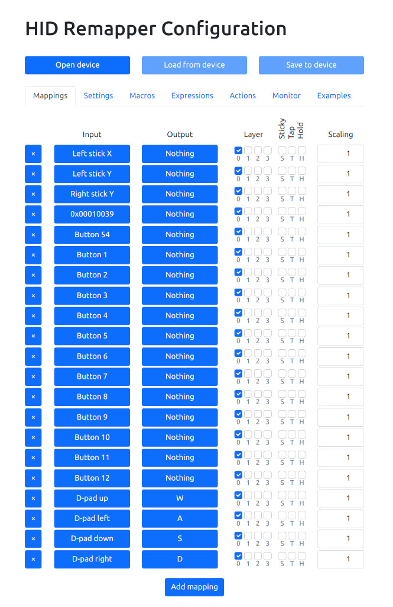
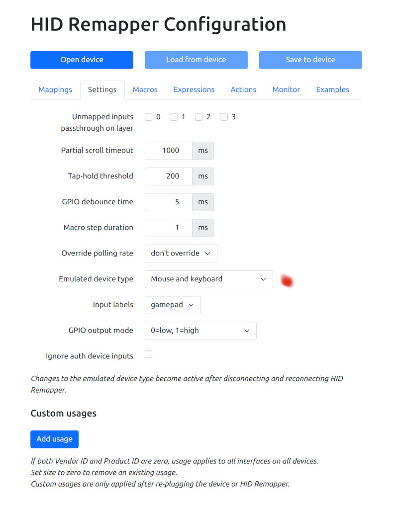

# Joystick To Keyboard

[hid-remapper](https://github.com/jfedor2/hid-remapper) can turn a Logitech
Extreme 3D Pro flight joystick into a keyboard. This is useful for games that
do not accept joystick input.

This was tested using an Adafruit Feather RP2040 USB Host board with optional
plastic case. The board comes completely assembled.

The mapping shows the dpad buttons mapped to WASD. The other joystick buttons
are mapped to nothing since this depends on the games and personal preferences.
Button 54 is a bug so ignore it.

Be sure to set the "Emulated device type" to "mouse and keyboard".

The configuration can be loaded from [this JSON file](https://github.com/controllercustom/le3dp2key/blob/main/le3dp2key.json). This is faster than
setting the mappings one line at a time.

Plug the Feather board into the computer. Open Chrome to
[hid-remapper-config](https://www.jfedor.org/hid-remapper-config/).

In the configuration screen, use the "Open device" button to open the Feather
board. Click on Actions then "Import JSON". Specify the le3dp2key.json file.
Next click on the "Save to device" button.

Unplug the Feather board and plug it back in to make sure it is using the
latest configuration. Plug the joystick into the Feather board.
